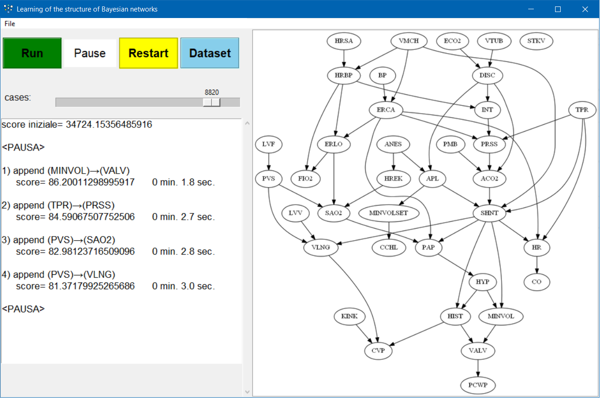

# Learning of the structure of Bayesian networks (2017)
Progetto IA Corso di Laurea Triennale.
Implementazione si un algoritmo per l’apprendimento della struttura di reti Bayesiane descritto in [Heckerman (1997)](http://machinelearning102.pbworks.com/f/Tutorial-BayesianNetworks.pdf), utilizzando la formula di [Cooper and Herskovits (1992)](http://s3.amazonaws.com/academia.edu.documents/46286253/bayesianNetworks1992.pdf?AWSAccessKeyId%3DAKIAJ56TQJRTWSMTNPEA&Expires%3D1483573613&Signature%3DGJD5leY5zs5QY5ybQCX8glqq%252FtE%253D&response-content-disposition%3Dinline%253B%2520filename%253DA_Bayesian_Method_for_the_Induction_of_P.pdf) come obiettivo per una ricerca greedy basata su hill climbing.

## Requisiti

- Python 3

## Librerie

- Tkinter
- Networkx
- Numpy
- Pillow

## Interfaccia grafica

